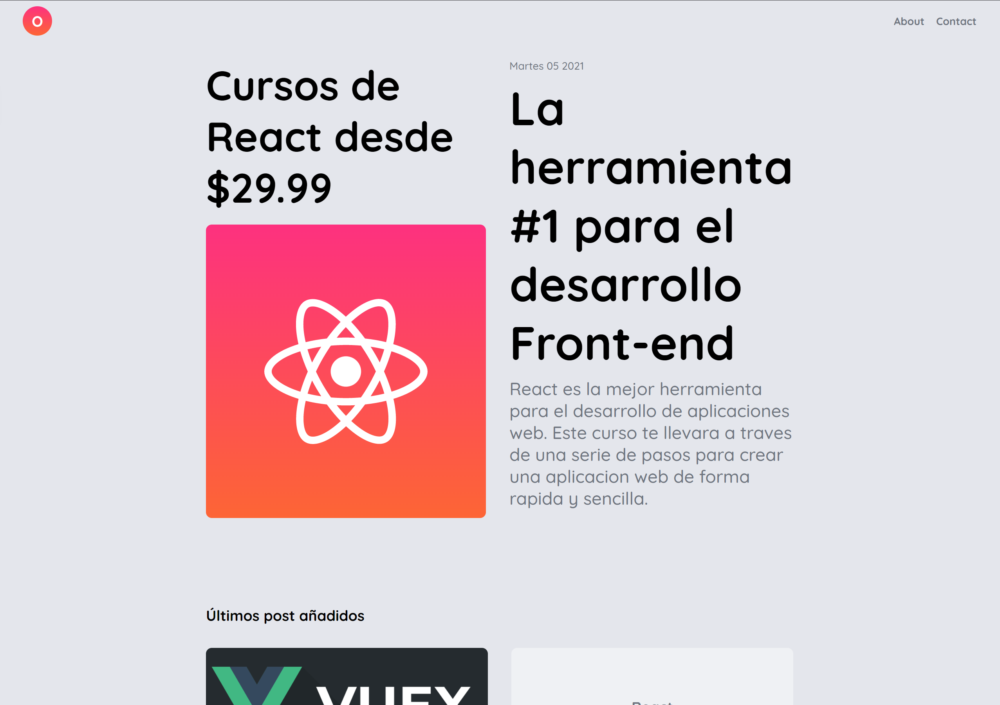
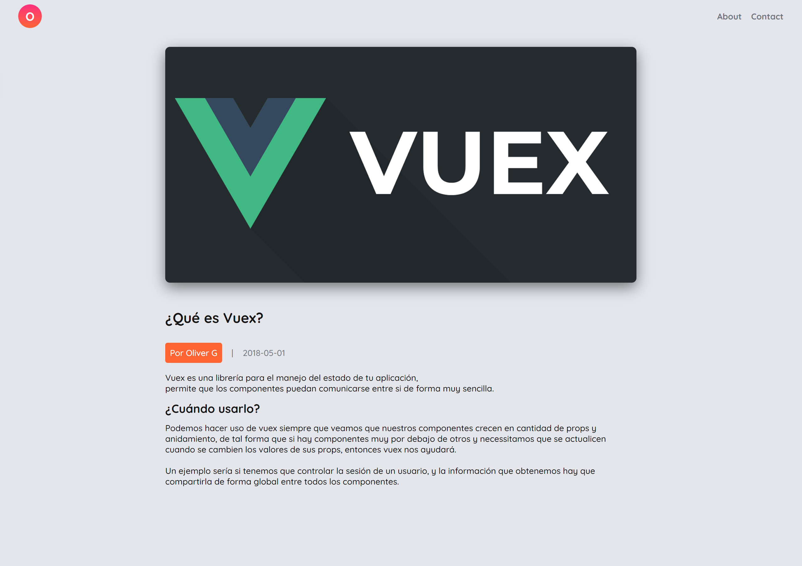
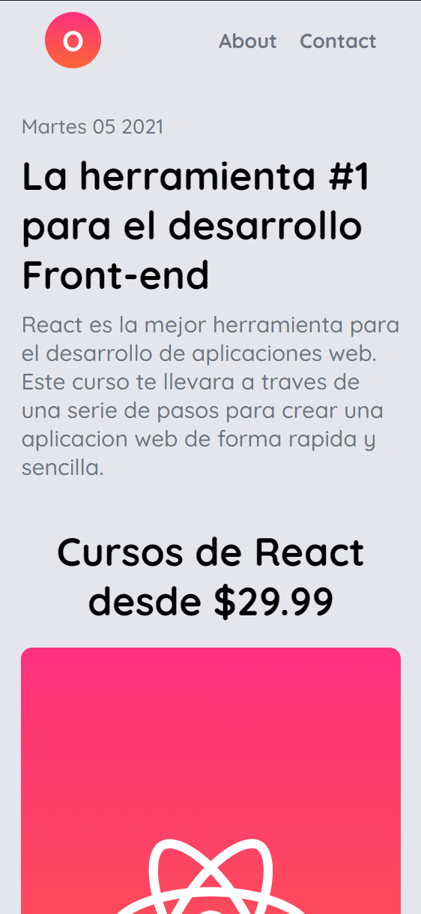
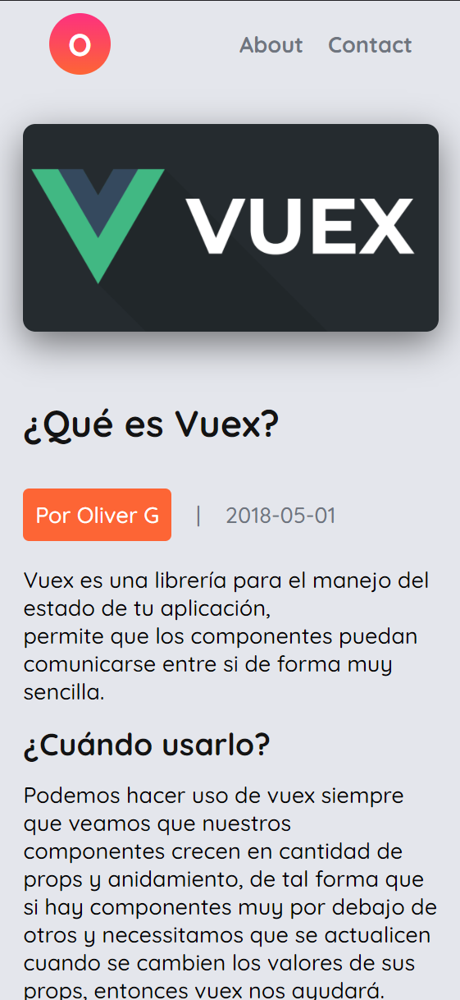

# Blog JamStack  

Este es un blog práctico haciendo uso de stack JAM,   
con el fin de preparar un proyecto con las configuraciones  
necesarias para el desarrollo del blog.

## Tecnologias

- [next.js](https://nextjs.org/)
- [sass](https://sass-lang.com/)
- markdown

## Diseño responsivo 

